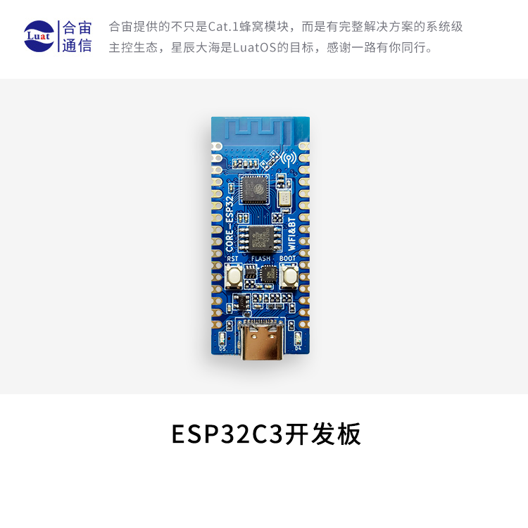
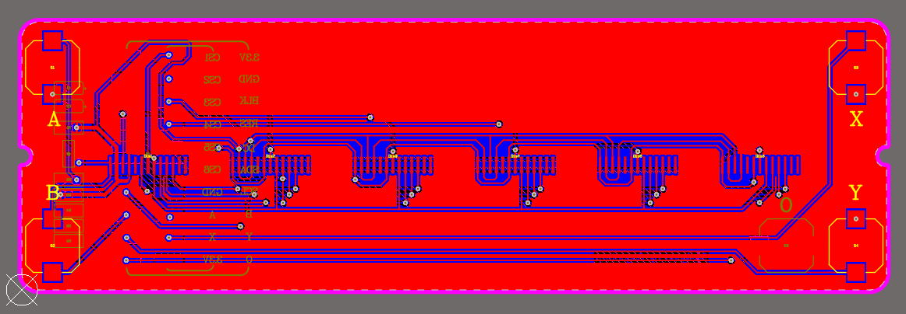
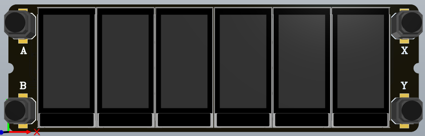
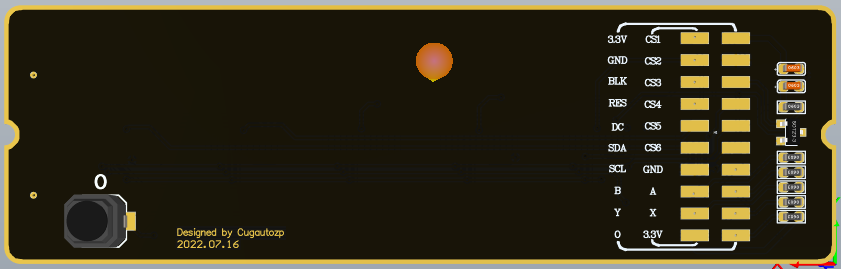
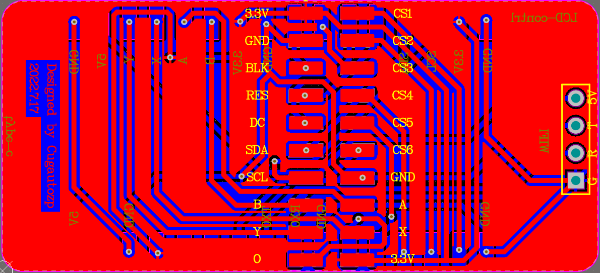
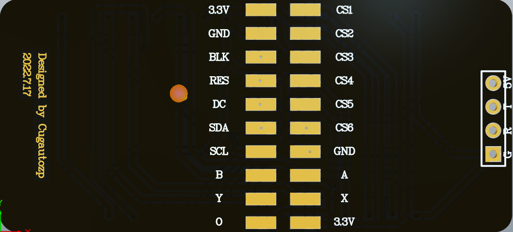
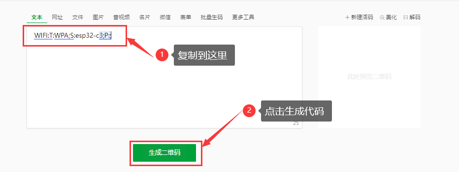

# Readme

[TOC]


## 0. 引言

之前一直想做一个辉光管时钟，由于成本太大，改为用LCD替换制作成类辉光管时钟，在github上看到了一个一模一样的项目废话不多说直接复刻

本项目为基于github上displayArray项目，其为一个开源的项目链接：[https://github.com/JosueAGtz/displayArray](https://github.com/JosueAGtz/displayArray)，项目作者使用的是==ESP32-S2==作为MCU，本人使用的是==合宙esp32-c3==，在复现的过程遇到了有几个问题之处。

- 遇到问题：
  
  - 图片显示都是反色。本人先买了==合宙esp32-c3（旧版）+LCD屏==测试了一下，这个LCD和项目使用的是一个屏幕都是ST7735s，一开始用转化好的图片.h库，显示是反色。本人重新取模发现这个屏幕是GBR排列，所以生成图片的时候得先反色再高位在前（为了方便本人已经将图片的.h重新更新了一下）
- 本人复刻过程
  - step1: 将==esp32-s2==代码转化可以烧录到合宙板子的代码，再用==合宙esp32-c3（旧版）+LCD屏==测试了一下程序，成功后就开始step2 设计PCB
  
    <video src="Readme-Fig/1.mp4"></video>
  
  - step2: 根据原理图重新设计并绘制PCB（ `主控` 和 `按键` 换了）
  
  - step3: 重新在别人的基础上更改及重新添加新功能
  
  - 注意：esp32-c3 的 GPIO11是需要解锁的，解锁前是一直给flash供电使用的，解锁后就可以当正常的GPIO使用。（在[Firmware](#3. Firmware)）

## SPI 屏幕——st7735


## 2. Hardware

主控：合宙esp32-c3开发版

官方手册链接：[ESP32C3-CORE开发板 - LuatOS 文档](https://wiki.luatos.com/chips/esp32c3/board.html)



其中使用AD20绘制了两个硬件

- displayLCD
- displaycontrl
- Hardware附件(材料来源等)

### 1. displayLCD

其中包含了6个SPI的TFT 80×160的屏幕的PCB，提供了5个按键可供多元创意开发







实物如下：


### 2. displaycontrl

绘制了主控板，与合宙的esp32-c3开发板缝合。还留有 RX 和 TX 以供有人选取esp32-c3新版开发板下载程序问题。





实物图如下：


### 3. 硬件附件

|      材料      |                       名称                        | 购买链接 |
| :------------: | :-----------------------------------------------: | :------: |
| TFT0.96”的屏幕 |                 st7735s (80×160)                  |          |
|     开发板     | 合宙esp32-c3（旧版）价格：12.9，（新版）价格：9.9 |          |
|      按键      |              6\*6*5贴片无声硅胶按键               |          |
|      排针      |                 卧式贴片排针公/母                 |          |


## 3. Firmware

采用编译环境是：Vscode + platformIO + Arduino框架

### 1. 安装教程

- Vscode 官方下载链接：[Visual Studio Code](https://code.visualstudio.com/)
- 看这位（up 主：Homepea）视频：[Vscode + platformIO + Arduino安装及配置环境教学视频](https://www.bilibili.com/video/BV1tv411w74d?spm_id_from=333.337.search-card.all.click&vd_source=a52483da66a3281a1fdcd67cbbf528bb)

### 2. 代码解释

- 代码在文件：`Firmware/code`
- 配置好环境后，打开工程文件`code`，编译一下主函数`main.cpp`
- 代码注意事项及部分解释在 [Code Readme](./Firmware/Readme.md) 

### 3. 图片取模Tool

- 为了增加diy可玩性，提供取模工具在文件`Tool`，以供大家选取自己喜欢的图片
- 如果图片是`.png`格式建议转化为`.jpg`格式


### 4. 二维码生成

- 二维的生成是用来配置esp32-c3的WiFi，让它连接想要连接的WiFi热点，比直接写在代码中会比较灵活一些

- Wifi 配置使用二维码扫描连接ESP32C3的热点(热点名及密码由 user_config.h 中 AP_SSID和AP_PASSWORD 配置), 同步需要修改二维码图片 (WifiQrcode.h): 

  ```txt
  WIFI:T:WPA;S:热点名;P:密码;
  
  例如：WIFI:T:WPA;S:esp32-c3;P:;
  ```

  到草料网：[草料二维码生成器 ](https://cli.im/) ，（可以更具自己的喜好更改样式）

  把上面的例子复制

  

  点击这个设置，设置到 `80px`，改完后直接下载

  

  

  > 在编写的过程中遇到了一些问题，询问了一位大佬，非常感谢这位大佬的答疑解惑，Github: [Kerrbty/ESP32C3Clock: 太空人时钟，基于ESP32-C3芯片](https://github.com/Kerrbty/ESP32C3Clock)

